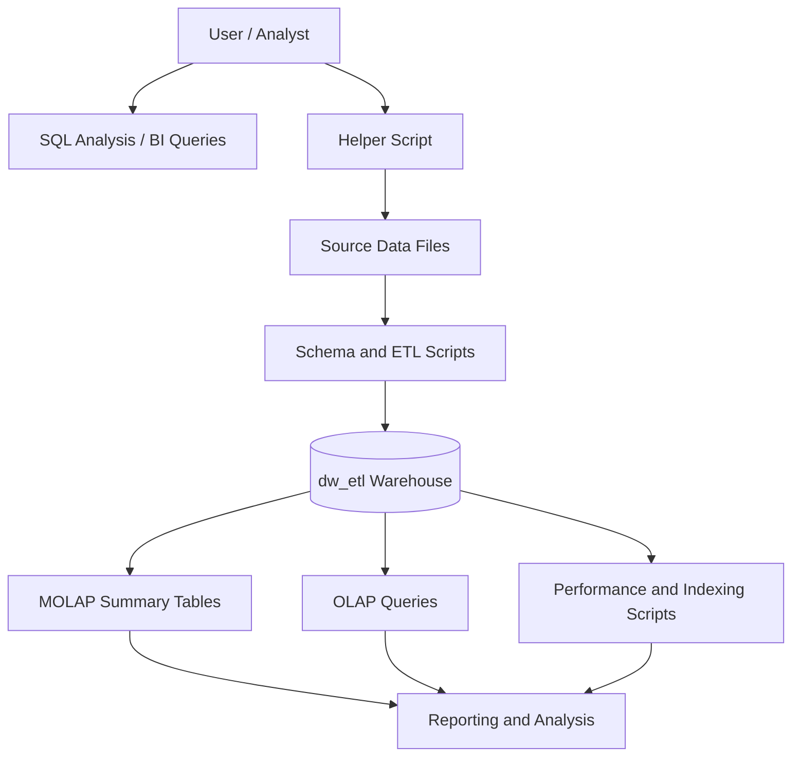
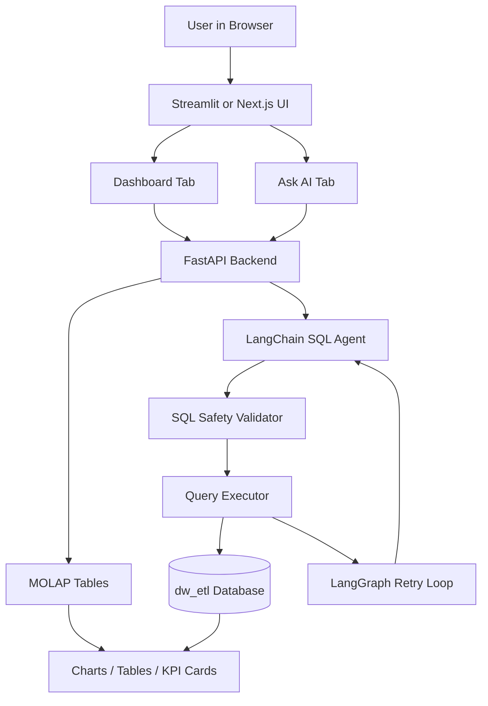

# FinQuery — AI Warehouse Analytics & Natural Language SQL Agent

> Financial data warehouse + analytics platform roadmap: dimensional modeling, ETL, MOLAP summary tables, OLAP workloads, and a planned application layer for a live dashboard plus a self-correcting NL-to-SQL agent.

---

## Executive Summary

FinQuery is a recruiter-facing data engineering and applied AI project built around a production-style warehouse design. The repository already contains the warehouse foundation, and the next phase adds the high-impact product layer described in the project report:

1. **Live analytics dashboard** for fixed KPI reporting, replacing the lost Power BI deliverable
2. **Natural-language SQL agent** for ad hoc questions, built with LangChain and a light LangGraph retry loop

The positioning is intentional: the warehouse is the stable core, while the dashboard and agent layer demonstrate product thinking, SQL safety, observability, and deployment readiness.

---

## Architecture

### Current warehouse flow



### Planned application layer



This design keeps the dashboard deterministic and low-latency, while the agent path remains isolated, validated, and recoverable.

---

## Why This Project Stands Out

- **Star schema and dimensional modeling:** `dw_etl` is structured for analytical workloads rather than transactional reporting.
- **MOLAP-first reporting layer:** precomputed summary tables support fast dashboard reads and cleaner KPI delivery.
- **Self-correcting text-to-SQL design:** the planned agent uses LangChain for SQL generation and LangGraph only for the retry loop.
- **SQL safety by design:** validator rules, read-only database access, and restricted query execution reduce risk.
- **Production-minded observability:** the roadmap includes LangSmith tracing, evaluation pairs, and before/after accuracy measurement.
- **Deployment-ready architecture:** FastAPI, Docker, and cloud hosting are part of the planned application layer.

---

## Planned Advanced Features

The following features are described in the project plan and are intended for the next implementation phase:

### Live Dashboard

- Direct SQL-backed dashboard over MOLAP tables
- KPI views for monthly transactions, top customers, fraud by state, card brand performance, and city spend
- Fast, deterministic rendering with no LLM dependency
- Built for a recruiter-friendly first impression: immediate visual value, low latency, and clear business impact

### NL-to-SQL Agent

- Natural-language question handling for open-ended analytics requests
- LangChain-based SQL generation
- SQL validation layer that blocks unsafe or mutating statements
- LangGraph retry loop for runtime errors and query repair
- Structured answer formatting for readable, business-friendly output

### Observability and Evaluation

- LangSmith tracing for prompt, execution, and retry visibility
- Evaluation set with question-to-SQL pairs
- Before/after accuracy reporting to demonstrate improvement from self-correction

### Deployment and Delivery

- FastAPI backend for dashboard and agent endpoints
- Streamlit or Next.js frontend with dashboard and Ask AI tabs
- Docker-based packaging and cloud deployment
- Read-only database role and environment-based secret management

---

## What Exists in This Repository Today

- **Schema design:** `SQL/01_schema/schema.sql`
- **ETL logic:** `SQL/02_etl/etl.sql`
- **MOLAP tables:** `SQL/03_molap/molap_tables.sql`
- **Indexing and partitioning:** `SQL/04_indexing_partioning/indexing_partitioning.sql`
- **OLAP queries:** `SQL/05_olap_queries/olap_queries.sql`
- **Performance testing:** `SQL/06_performance/join_performance.sql`
- **Data preparation helper:** `SQL/helper/proj.py`
- **Design documentation:** `SQL/docs/schema_justification.sql` and `SQL/docs/WAREHOUSE_REDESIGN_NOTES.md`

---

## Tech Stack Keywords

| Area | Keywords |
| :-- | :-- |
| Data warehouse | PostgreSQL, star schema, dimensional modeling, ETL |
| Analytics | MOLAP, OLAP, KPI dashboards, summary tables |
| AI / Agentic SQL | LangChain, LangGraph, LangSmith, text-to-SQL |
| Backend | FastAPI, SQLAlchemy, Uvicorn |
| Frontend | Streamlit, Next.js, Plotly, Recharts |
| Safety | SQL validation, read-only role, query guardrails |
| Deployment | Docker, cloud hosting, CI/CD |
| Language | Python, SQL |

---

## Repository Structure

```text
FinQuery/
├── SQL/
│   ├── 01_schema/
│   │   └── schema.sql
│   ├── 02_etl/
│   │   └── etl.sql
│   ├── 03_molap/
│   │   └── molap_tables.sql
│   ├── 04_indexing_partioning/
│   │   └── indexing_partitioning.sql
│   ├── 05_olap_queries/
│   │   └── olap_queries.sql
│   ├── 06_performance/
│   │   └── join_performance.sql
│   ├── data_raw/
│   ├── docs/
│   └── helper/
│       └── proj.py
├── .gitignore
└── README.md
```

---

## Documentation

- `SQL/docs/schema_justification.sql` explains the modeling decisions.
- `SQL/docs/WAREHOUSE_REDESIGN_NOTES.md` records the redesign and validation notes.
- `SQL/docs/schema_diagram.pdf` contains the schema diagram.

---

## Roadmap

The dashboard and agent layer are planned for the next build phase. The warehouse layer in this repository is the base that those features will sit on top of.
